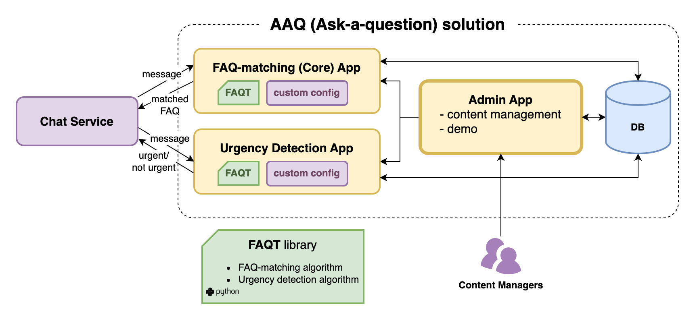

[](https://coveralls.io/github/IDinsight/aaq_admin_template)


# Ask A Question (AAQ) Admin App Template

To start development on a new AAQ solution, clone or fork this and follow the setup instructions below.

Ensure to pull in new features from this repository regularly.

## What is the Admin App?

This is a containerized flask app that provides the following functionality:

- By interacting with the [AAQ Core](https://github.com/IDinsight/aaq_core_template) app
    -   Demo AAQ service by sending test messages
    -   Manage FAQs
    -   Test new FAQs
- By interacting with the [AAQ Urgency
Detection](https://github.com/IDinsight/aaq_ud_template) app
    -   Manage Urgency Detection rules
    -   Test new Urgency Detection rules

The respective apps need to be running for the above functions to work.

You can view the admin app at `{server address}:9903/` in your web browser.




## Setup

### Copy this code

Clone or fork this repository.

If you clone this, please setup a new repository for future commits and add this repository as another remote - called `template`. This will allow you to pull in new changes made to this template. Here are the instructions on how to do this:

1. Clone this repo

    ```
    git clone git@github.com:IDinsight/aaq_admin_template.git <project_name>
    ```

2. Change remote name to `template`

    ```
    git remote rename origin template
    ```

3. Create a [new repo](https://github.com/organizations/IDinsight/repositories/new) in Github
4. Add it as remote for local repo

    ```
    git remote add origin git@github.com:IDinsight/<project_name>.git
    ```

5. Set local to track that remote

    ```
    git push -u origin main
    ```

### Configure project details

The `project_config.cfg` config file should be updated with your project details.

-   `PROJECT_NAME`: e.g. your git repository name
-   `PROJECT_SHORT_NAME`: used for DB schema name
-   `PROJECT_CONDA_ENV`: conda environment name
-   `AWS_ACCOUNT_ID`: your AWS account ID for publishing the image to ECR
-   `AWS_REGION`: your ECR region

#### Display variables
In `admin_webapp/app/config/parameters.yml` under `jinja_variables`,
- To change the header text of the app, edit the `PROJECT_DISPLAY_NAME`.
- To change the number of FAQs displayed per page on "Manage FAQs" page, change the value in `NUM_FAQS_PER_PAGE`

### Initialise

#### Run `make setup-dev`

This command does the following:

1. Creates a `conda` virtual environment
2. Installs dependencies from `requirements.txt` and `requirements_dev.txt`
3. Installs pre-commit hooks
4. Creates secrets files in `./secrets/`

#### Run `make setup-ecr`

This creates the ECR repository for the project to store docker images. This step is not
necessary if you have done this already in another AAQ app (e.g. core).

### Enter details in secrets file

You should edit each of the files in `./secrets` and set the correct parameters.

Note the DB connection details and DB secrets as instructed by
[`infrastructure/README.md`](https://github.com/IDinsight/aaq_core_template/tree/main/infrastructure),
and save them in `secrets/database_secrets.env` and `tests/config.yaml`.

To use other `make` commands, [set the secrets as environment variables for the conda environment](https://docs.conda.io/projects/conda/en/latest/user-guide/tasks/manage-environments.html#saving-environment-variables).

### Other tasks

1. Setup auto deployment on EC2 (using webhooks or other)
2. Enable UD by passing `enable_ud=True` to `create_app` in `aaq_admin_template/admin_webapp/flask_app.py`. If you want to run pytests with UD disabled, make sure to pass `-m "not ud_test"` option to pytest to exclude UD tests.
3. Update this file!
    -   Remove irrelevant content (all the template text)
4. Setup other apps as necessary

## Running Project

To run this project:

1. Setup environment as determined above.
2. Run `make image` from the root folder.
3. Run the Docker container by calling `make container` from the root folder.

## Troubleshooting

It is possible that users may encounter bugs while using the Admin app. Upon encountering a bug, the best way to identify the issue is to go through the following steps:

1. SSH into the EC2 instance where the Admin app container is running,
2. Run the command 
    ```
    docker logs <CONTAINER_NAME>
    ```
3. View the latest logs tracked by the container which will likely show the error encountered by the app.

As an example, we highlight one specific error - a DB error - that occured during testing:

-   We followed the above steps to check the docker container logs for the admin app. We noticed the following error -

```
sqlalchemy.exc.IntegrityError: (psycopg2.errors.UniqueViolation) duplicate key valueviolates unique constraint "faqmatches_pkey"
DETAIL:  Key (faq_id)=(182) already exists.
```

-   This error occurs when a DB primary key column gets manually written, likely when data is copied into a new table. In the above case, this error occured because Key (faq_id)=(182) already existed but the faq_id column's sequence was set at < 182.
-   This causes the DB to error out when using the "Add FAQ" functionality of the app because the new FAQ is added with an ID that already exists.

To fix the above issue, one can do the following -

1. Log into the relevant DB
2. Check the maximum value of the key column: 
    ```
    SELECT MAX(faq_id) FROM faqmatches;
    ```
3. Check the nextvalue of the key column's sequence
    ```
    SELECT nextval('faqmatches_faq_id_seq');
    ```
4. If the above two values do not match, run the query 
    ```
    SELECT setval('faqmatches_faq_id_seq', (SELECT MAX(faq_id) FROM faqmatches)+1);```