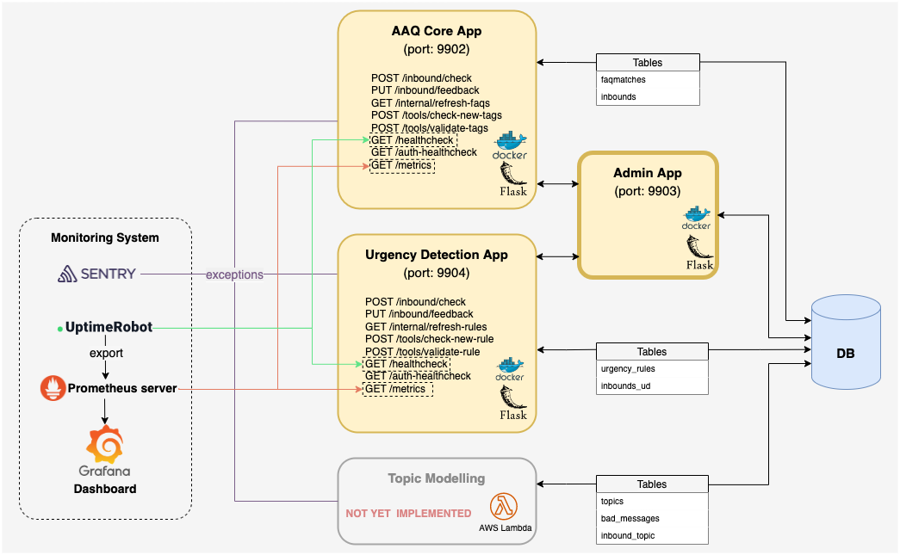

June 7, 2022

CURRENT VERSION: aaq_admin_template:v1.0.0
# Deploying the AAQ Admin App

This is the deployment instructions for the **AAQ Admin App**. It does not cover deployment of the AAQ Core or UD Apps.

The AAQ Admin App provides a convenient interface to 
1. add to or modify content tables (`faqmatches` for FAQs, and `urgency_rules` if urgency detection is enabled), and
2. test new contents (new sets of tags for FAQs, and urgency rules if urgency detection is enabled).

# Initial setup

First set up the AAQ Core App (from `aaq_core_template`) and optionally the urgency detection app (from `aaq_ud_template`).

# Images

The Docker image for the core model server is hosted on AWS ECR at
`[AWS_ACCOUNT_ID].dks.ecr.af-south-1.amazonaws.com/aaq_solution/aaq_admin_template:v1.0.0`

Your AWS user will need access to this resource. Please contact IDinsight for access.

## Resources for images

The Admin app doesn't require many resources as the heavy processing is done in the Core and UD apps.

## Image setup

* The inbound port mapping is 9903:9903 (TCP).

### Environment variables
The following environment variables are required:
- Postgres
  - `PG_ENDPOINT`: Postgres instance endpoint
  - `PG_PORT`: Postgres port
  - `PG_DATABASE`: Database name
  - `PG_USERNAME`
  - `PG_PASSWORD`
- Core app information
  - `MODEL_HOST`
  - `MODEL_PORT`
  - `MODEL_PROTOCOL`
  - `INBOUND_CHECK_TOKEN`: Bearer token set in the AAQ Core app
- Urgency detection app information (if it's enabled)
  - `UD_MODEL_HOST`
  - `UD_MODEL_PORT`
  - `UD_MODEL_PROTOCOL`
  - `UD_INBOUND_CHECK_TOKEN`: Bearer token set in the AAQ Urgency Detection app
- Login credentials
  - `READONLY_PASSWORD`: Password to the user `readonly_user` with read-only access -- cannot add, edit, or delete contents.
  - `FULLACCESS_PASSWORD`: Password to the user `fullaccess_user` with read and write access to contents.
